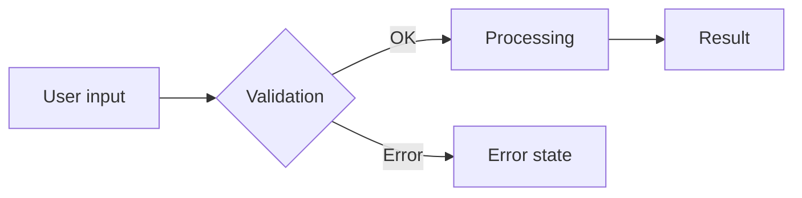
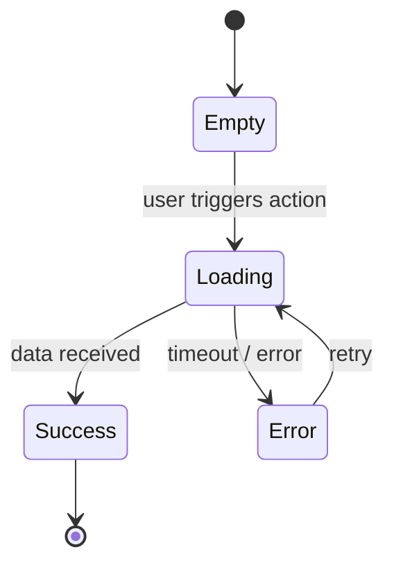

# /create — from idea to finished spec

Pipeline for transforming a loose idea into an agent-ready specification. The output is a structured document that an agent (Jira, GitHub, or general LLM) can process directly.

**Model**: Sonnet

---

## Pipeline overview

```
Idea → [Round 1: Context] → [Round 2: Detail] → [Analysis] → [UI/UX Spec] → [Final Spec]
```

Every step is mandatory and must be completed in order. Don't skip steps.

## Language

- **Intake is in Czech.** The question rounds, clarifications, and any explanation you give the user in chat are in **Czech** — so decisions don't get lost in technical English.
- **The generated artifact is in English.** The final spec / issue / agent prompt (titles, descriptions, acceptance criteria, wireframe labels, out-of-scope) is written entirely in **English**. Use Czech only inside quotes/code when citing an actual UI string or a legal/domain term (e.g. `"neplátce DPH"`). Don't mix the two languages in prose.

---

## Step 1 — First round of questions (Context)

Ask the user these 3 things at once via `AskUserQuestion` / interactive questions:

### Round 1 required questions

1. **App / Context** — *Where or in what does this live? (web, mobile app, CLI tool, API, design system…)*
2. **Primary input** — *What is the primary input? (user action, system data, file, event…)*
3. **Expected output** — *What does the user / system get at the end? (UI state, file, notification, DB record…)*

Wait for answers. Don't proceed without them.

---

## Step 2 — Second round of questions (Detail)

Based on round 1 answers, clarify:

### Round 2 required questions

1. **Edge cases** — *What happens when the input is missing, invalid, or the action fails?*
2. **Integrations / dependencies** — *What does this depend on? (API, services, other features, design system, auth…)*
3. **Constraints / Out of scope** — *What does this feature / tool explicitly NOT handle?*

If round 1 answers already clearly address any of these, skip them and remind the user what you derived.

---

## Step 3 — Context analysis

Before writing the spec, do:

### 3a. Finding relevant context

Identify from the current conversation (or ask):
- Existing files / components this relates to? (3–5 key ones)
- Are there duplicate or overlapping issues/tasks?

If the user is working with a repository or design system, explicitly ask about relevant files.

### 3b. Analysis conclusions

Briefly summarize (2–4 points):
- What from the context influences the design
- Where there is uncertainty or risk
- What needs to be verified before implementation

---

## Step 4 — UI/UX Specification

Generate the UI/UX section. Always includes:

### 4a. UI text description

```
## UI/UX Specification

### Screens / States
- [State name]: [Description of what user sees and can do]
- [Error state]: [How the error looks]
- [Loading state]: [Loader / skeleton / blocking]

### Interactions
- [Trigger] → [What happens] → [Resulting state]

### Components
- [Component] — [source: design system / new / adapted existing]
```

### 4b. Mermaid wireframe

Always include a simplified wireframe as a Mermaid diagram. Prefer `flowchart LR` for flows or `stateDiagram-v2` for UI states.

Example wireframe for a flow:


Example for UI states:


---

## Step 5 — Assemble Final Spec

The final output is an agent-ready document. Use exactly this structure:

```markdown
# [Feature / tooling name]

## 📋 Description
<2–4 sentences: what it is, for whom, what problem it solves>

## 🎯 Context & Motivation
<why it's being built, what the business / UX reason is>

## ⚙️ Input / Output
| | Description |
|---|---|
| **Input** | <primary input> |
| **Output** | <what user/system gets> |
| **Trigger** | <what starts the flow> |

## ✅ Done when (Acceptance Criteria)
- [ ] <criterion 1 — machine-verifiable>
- [ ] <criterion 2>
- [ ] <edge case covered>
- [ ] <error state handled>

## 🚫 Out of Scope
- <what this feature does not handle — explicitly>

## 🖼️ UI/UX Specification
<section from Step 4 — text description + mermaid wireframe>

## 🧪 Acceptance Test
<at least 1 specific, machine-verifiable test>

Format:
GIVEN <initial state>
WHEN <action>
THEN <verifiable result>

## 📊 Tier & Metadata
| Field | Value |
|---|---|
| **Tier** | Tier X (1–3) |
| **Complexity** | simple / medium / complex |
| **Dependencies** | <list or "None"> |
| **Risks** | <what could fail> |
```

---

## Tier classification

| Tier | Criteria |
|------|----------|
| **Tier 1** 🟢 | Isolated change, 1–2 components, clear solution, < 1 day |
| **Tier 2** 🟡 | Multiple components / screens, coordination or testing needed, 1–3 days |
| **Tier 3** 🔴 | Architectural decision, cross-team, unclear solution, > 3 days |

Always **justify** the tier with one sentence.

---

## Quality rules

### Acceptance Criteria
- Every AC must be **testable** — not "works correctly" but "after clicking X, Y is displayed"
- **At least 1 criterion must be machine-verifiable** (unit test, E2E test, API response check)
- Cover: happy path, error state, edge cases

### Acceptance Test
- Required format: `GIVEN / WHEN / THEN`
- Must be runnable automatically (or manually with an unambiguous result)
- "Verify visually" is not sufficient

### Wireframe
- Always include Mermaid — even for simple flows
- For multi-step flows, use `flowchart LR`
- For UI state transitions, use `stateDiagram-v2`

### Out of Scope
- Mandatory section — even if it has just 1 item
- Prevents scope creep during implementation

---

## Output formats

After generating the spec, **always create a GitHub issue immediately** using `gh issue create` — do not ask the user for confirmation or format preference. Use the full spec body as the issue body and the feature name as the title. Append `🤖 Generated with [Claude Code](https://claude.com/claude-code)` at the end of the body. Return the created issue URL to the user.

---

## References

See `references/spec-examples.md` for example outputs of various types (CLI tool, mobile feature, API endpoint, design system component).
