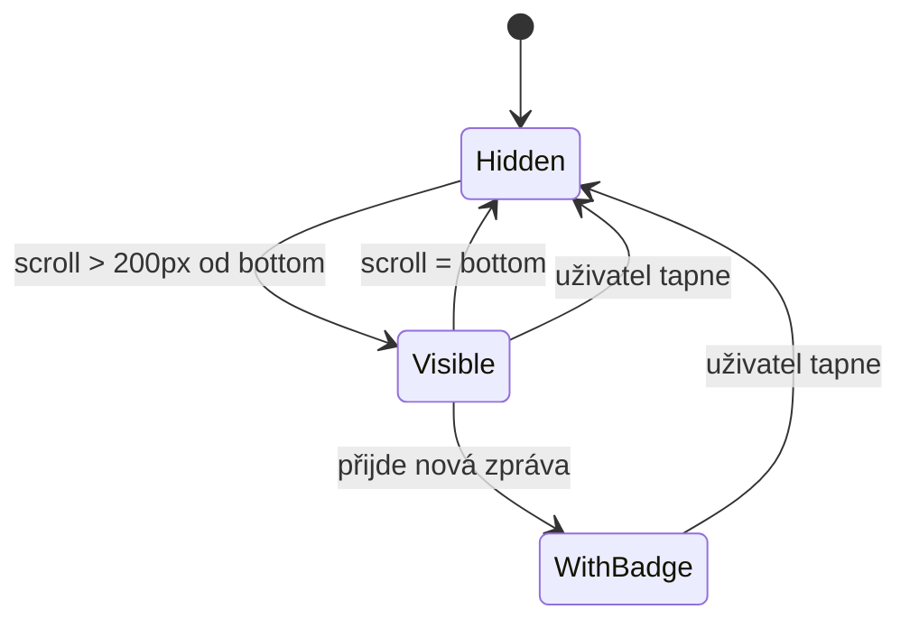
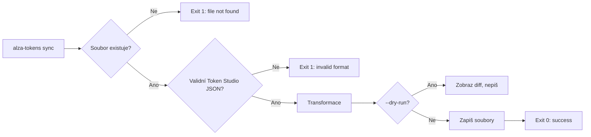
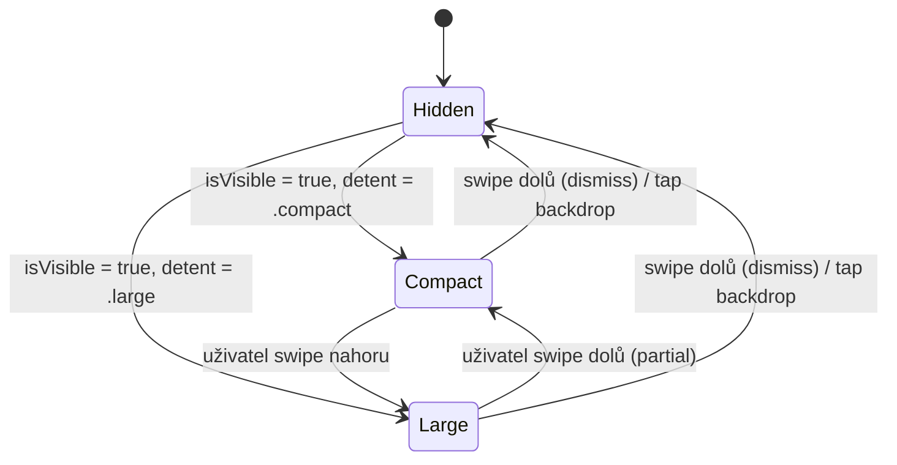

# Ukázkové výstupy `/create` skill

Tři příklady finálních spec dokumentů — mobilní featura, CLI tool, design systém komponenta.

---

## Příklad 1 — Mobilní featura (Tier 2)

```markdown
# Chat — Scroll-to-bottom tlačítko

## 📋 Popis
Plovoucí tlačítko v chat rozhraní, které se zobrazí když uživatel scrolluje nahoru a skryje se
když je u spodní zprávy. Tapnutí scrolluje na nejnovější zprávu.

## 🎯 Kontext & Motivace
Uživatelé v dlouhých konverzacích ztrácejí kontext a nevidí nové zprávy. Tlačítko zlepšuje
navigaci bez narušení stávajícího UI.

## ⚙️ Vstup / Výstup
| | Popis |
|---|---|
| **Vstup** | Scroll pozice chat listu |
| **Výstup** | Zobrazení / skrytí FAB tlačítka |
| **Trigger** | Scroll > 200px od spodního okraje |

## ✅ Hotovo když
- [ ] Tlačítko se zobrazí po odscrollování > 200px od spodního okraje
- [ ] Tapnutí animovaně scrolluje na poslední zprávu (< 300ms)
- [ ] Tlačítko se skryje když je uživatel na spodní zprávě
- [ ] Badge zobrazuje počet nepřečtených zpráv (pokud > 0)
- [ ] Funguje na iOS i Android (natívní scroll behavior)

## 🚫 Mimo rozsah
- Notifikace o nových zprávách při minimalizaci appky
- Haptic feedback při tapnutí
- Přizpůsobení barvy tlačítka per brand

## 🖼️ UI/UX Specifikace

### Obrazovky / Stavy
- **Skrytý stav**: tlačítko není přítomno v DOM / renderu
- **Viditelný stav**: FAB 44×44pt, bottom-right, 16pt od okrajů, nad tab barem
- **S badge**: červený badge top-right s číslem nepřečtených

### Interakce
- Scroll ↑ (> 200px od bottom) → fade in tlačítko (200ms)
- Scroll ↓ zpět na bottom → fade out tlačítko (200ms)
- Tap → smooth scroll to bottom → skrytí tlačítka

### Komponenty
- `ScrollToBottomFAB` — nová komponenta, vychází z `FABButton` v design systému
- Badge — existující `BadgeView` komponenta



## 🧪 Acceptance Test

GIVEN chat seznam s 50+ zprávami
WHEN uživatel scrolluje o 250px nahoru
THEN tlačítko scroll-to-bottom se zobrazí v bottom-right rohu do 300ms

## 📊 Tier & Metadata
| Pole | Hodnota |
|---|---|
| **Tier** | Tier 2 🟡 — dotýká se scroll logiky, nová komponenta, cross-platform |
| **Složitost** | střední |
| **Závislosti** | `FABButton`, `BadgeView`, chat scroll controller |
| **Rizika** | Různé scroll chování iOS vs Android keyboard avoidance |
```

---

## Příklad 2 — CLI Tool (Tier 1)

```markdown
# `alza-tokens sync` — CLI příkaz pro synchronizaci design tokenů

## 📋 Popis
CLI příkaz pro `alza-design-tokens` package, který synchronizuje tokeny z Token Studio
JSON exportu do Style Dictionary source souborů. Spouští se manuálně nebo v CI.

## 🎯 Kontext & Motivace
Ruční kopírování Token Studio exportu do Style Dictionary je chybové a zdlouhavé.
Příkaz automatizuje transformaci a zajišťuje konzistentní strukturu.

## ⚙️ Vstup / Výstup
| | Popis |
|---|---|
| **Vstup** | Token Studio JSON export (`tokens.json`) |
| **Výstup** | Aktualizované Style Dictionary source soubory v `src/tokens/` |
| **Trigger** | `npx alza-tokens sync --input tokens.json` |

## ✅ Hotovo když
- [ ] `alza-tokens sync --input <file>` úspěšně transformuje Token Studio JSON
- [ ] Výstupní soubory odpovídají Schema Style Dictionary v3
- [ ] Při chybě vstupu (nevalidní JSON) CLI vrátí exit code 1 + srozumitelnou chybu
- [ ] `--dry-run` flag zobrazí diff bez zápisu souborů
- [ ] Unit test pokrývá transformaci primitive → semantic tokenů

## 🚫 Mimo rozsah
- Automatická synchronizace z Figma API (jen lokální soubory)
- Push do Gitu (orchestrace CI je mimo scope)
- Podpora Token Studio v1 formátu

## 🖼️ UI/UX Specifikace

### CLI Flow
- Úspěch: progress bar → `✓ Synced 142 tokens to src/tokens/`
- Chyba souboru: `✗ Error: Cannot read input file: tokens.json not found`
- Validační chyba: `✗ Error: Invalid Token Studio format at $.color.primary`



## 🧪 Acceptance Test

GIVEN validní Token Studio JSON export s primitive a semantic tokeny
WHEN spustíme `npx alza-tokens sync --input tokens.json`
THEN v `src/tokens/` existují aktualizované soubory a process exituje s kódem 0

## 📊 Tier & Metadata
| Pole | Hodnota |
|---|---|
| **Tier** | Tier 1 🟢 — izolovaný CLI příkaz, jasné I/O, žádné UI |
| **Složitost** | jednoduchý |
| **Závislosti** | `style-dictionary`, Token Studio JSON schema |
| **Rizika** | Breaking changes v Token Studio export formátu |
```

---

## Příklad 3 — Design systém komponenta (Tier 2)

```markdown
# `BottomSheet` — iOS-native bottom sheet komponenta

## 📋 Popis
Nativně vypadající bottom sheet pro iOS a Android s podporou drag-to-dismiss,
různých výšek (compact / expanded) a scroll obsahu uvnitř sheetu.

## 🎯 Kontext & Motivace
Aktuálně se používá modal dialog, který nevypadá nativně a nemá drag gesture.
Bottom sheet je standard pro kontextové akce v mobilních appkách.

## ⚙️ Vstup / Výstup
| | Popis |
|---|---|
| **Vstup** | `isVisible: Bool`, `content: View`, `detents: [.compact, .large]` |
| **Výstup** | Prezentovaný sheet s drag handle a dismiss gesturou |
| **Trigger** | Programatický (`isVisible = true`) nebo uživatelská akce |

## ✅ Hotovo když
- [ ] Sheet se prezentuje s animací (spring, 350ms) ze spodního okraje
- [ ] Drag handle je zobrazen nahoře uprostřed sheetu
- [ ] Swipe dolů zavře sheet (velocita > 500 pt/s nebo offset > 50% výšky)
- [ ] Tap na backdrop zavře sheet
- [ ] `detent: .compact` = 40% výšky obrazovky, `.large` = 90%
- [ ] Scroll uvnitř sheetu nekoliduje s drag-to-dismiss gesturou
- [ ] Sheet respektuje safe area (notch, home indicator)

## 🚫 Mimo rozsah
- Custom výška sheetu (jen preset detenty)
- Nested sheety (sheet uvnitř sheetu)
- Landscape orientace (pouze portrait v první verzi)

## 🖼️ UI/UX Specifikace

### Stavy
- **Skrytý**: off-screen pod spodním okrajem
- **Compact**: 40% výšky, drag handle viditelný, obsah scrollovatelný
- **Large**: 90% výšky, backdrop ztmavený (0.4 opacity)
- **Dismissing**: animace slide-down + backdrop fade out

### Komponenty
- `BottomSheet` — nová komponenta
- `DragHandle` — nová sub-komponenta (4×36pt pill, `surfaceVariant` barva)
- `Backdrop` — existující `ModalBackdrop` komponenta



## 🧪 Acceptance Test

GIVEN bottom sheet s detent = .compact
WHEN uživatel provede swipe dolů rychlostí > 500 pt/s
THEN sheet se zavře s animací slide-down do 350ms a `isVisible` se nastaví na false

## 📊 Tier & Metadata
| Pole | Hodnota |
|---|---|
| **Tier** | Tier 2 🟡 — nová komponenta, gesture logika, cross-platform chování |
| **Složitost** | střední |
| **Závislosti** | `ModalBackdrop`, design token `motion.spring`, safe area API |
| **Rizika** | Gesture conflict se scroll view na Androidu (GestureDetector prioritization) |
```
